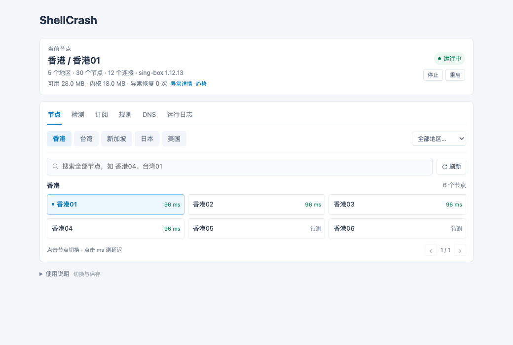

# Padavan ShellCrash Panel

给 K2P / MT7621 的 Padavan 后台增加一个轻量 ShellCrash 管理页。复用路由器现有的认证、httpd、cron 和 ShellCrash，不增加常驻 Web 服务。

> **0.1.0 是实验性扩展包，不是路由器固件，也不包含完整 ShellCrash。** 原始部署已在 K2P 上验证启动与重启；本仓库整理后的通用安装器经过离线检查，尚未在另一台干净设备上完整安装验证。请在维护时间部署并准备回滚。

## 界面预览

以下图片使用虚构节点和模拟状态，数值不是性能测量。




## 能做什么

- 后台菜单 `高级设置 → ShellCrash`，保留原 SSR 页面；登录路由器后无需再输入面板密钥。
- 按地区展开具体节点、切换并保存选择，首次打开和切换地区自动测速。
- 国内、国外网站检测与品牌图标。
- 订阅更新、启动/停止/重启、DNS 模式与 Fake IP 例外名单、国内 IPv4 规则更新。
- 日志查看和清空，内核检查及更新，内存趋势、低内存保护、异常时间与诊断证据。
- 配置落入 Storage；程序放在 RAM，重启按自定义镜像优先、公共源兜底下载并校验。

不包含任何真实订阅、节点、账户密码、ZeroTier 身份、私有镜像地址或用户完整备份。

## 适用范围

| 项目 | 首版要求 |
| --- | --- |
| 设备 | K2P / MT7621，MIPSLE，128 MB RAM |
| 固件 | 原始验证版本 Padavan 4.4.198.9-100_20220804；其他分支需适配 `/www`、`nvram_dump` 和 Storage |
| 框架 | 已安装并配置的 ShellCrash **1.9.4**，目录 `/etc/storage/ShellCrash` |
| 内核 | sing-box mini **1.12.13**，`mipsle-softfloat`；不支持用本安装器切换 Clash |
| 规则 | 已有 `/etc/storage/chinadns/chnroute.txt` |
| 接管 | IPv4 TCP 和 DNS；普通 UDP 直连、AAAA 拒绝；不提供全协议透明代理 |

订阅入口接受 **AnyTLS URI/Base64** 或 **sing-box JSON 节点**；JSON 协议能否运行取决于 mini 内核实际构建能力。不是通用 Clash YAML、SSR/VMess URI 转换器。

## 部署

完整步骤见 [部署指南](docs/DEPLOYMENT.md)，设计和限制见 [架构与内存](docs/ARCHITECTURE.md)，回滚见 [恢复指南](docs/RECOVERY.md)。

1. 备份路由器现有 Storage，停止旧 SSR 服务。已有自定义启动钩子时先人工合并，不会自动覆盖。
2. 在电脑上用 Python 3 将私有 sing-box 节点 JSON 转成面板配置：

```sh
python3 tools/prepare_profile.py --input nodes.json --output config.private.json \
  --lan-ip 192.168.1.1 --secret-file panel-secret.private --cn-list chnroute.txt
```

`--lan-ip` 必须换成自己的网关；`chnroute.txt` 从路由器取得。生成的配置和密钥应留在本地，**不得提交到仓库**。

3. 将发布包、上述配置和密钥上传到路由器 `/tmp`，解压后执行：

```sh
sh install.sh --check --profile /tmp/config.private.json
sh install.sh --install --profile /tmp/config.private.json --secret-file /tmp/panel-secret.private
```

4. 登录路由器原管理页，刷新缓存后打开 ShellCrash。下载安装前备份 `/tmp/padavan-panel-before-install.tar.gz`，随后删除 `/tmp` 中的私有安装输入。

安装器修改 ShellCrash 配置、启动钩子和官方标记的自启动条目，停止原内核，再校验新服务。失败会尝试恢复 Storage；运行覆盖清理由维护时重启完成。不要在远程唯一管理链路上盲装。

## 开发与验证

```sh
python3 tests/test_project.py
python3 tools/build_release.py
```

验证包括脚本语法、配置生成、名单转换和公共包内容。若安装了 Node.js，还会检查前端脚本语法。测试不会连接或修改真实路由器。可选 GitHub Actions 模板见 `docs/ci-example.yml`，启用时复制到 `.github/workflows/ci.yml`。

## 来源与许可

GPL-3.0-only。包含修改的 [ShellCrash](https://github.com/juewuy/ShellCrash) 文件；原作者版权声明保留。修改文件清单、图标来源和商标说明见 [NOTICE](NOTICE.md)。本项目不是 ShellCrash 官方发行版。内核与规则按需从上游下载，不随包分发。
