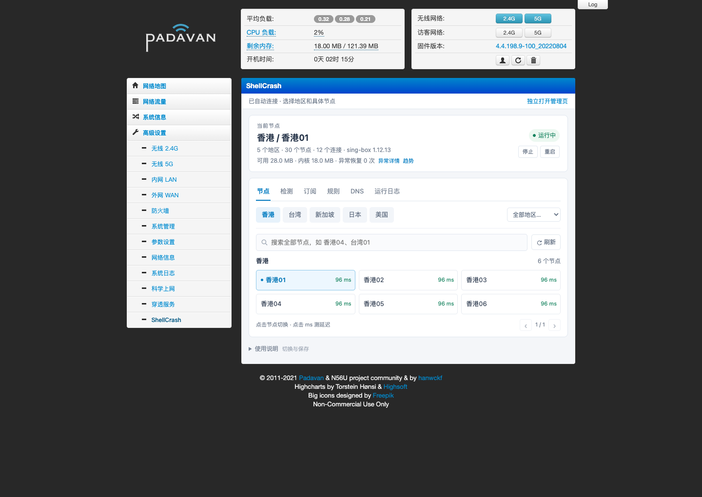
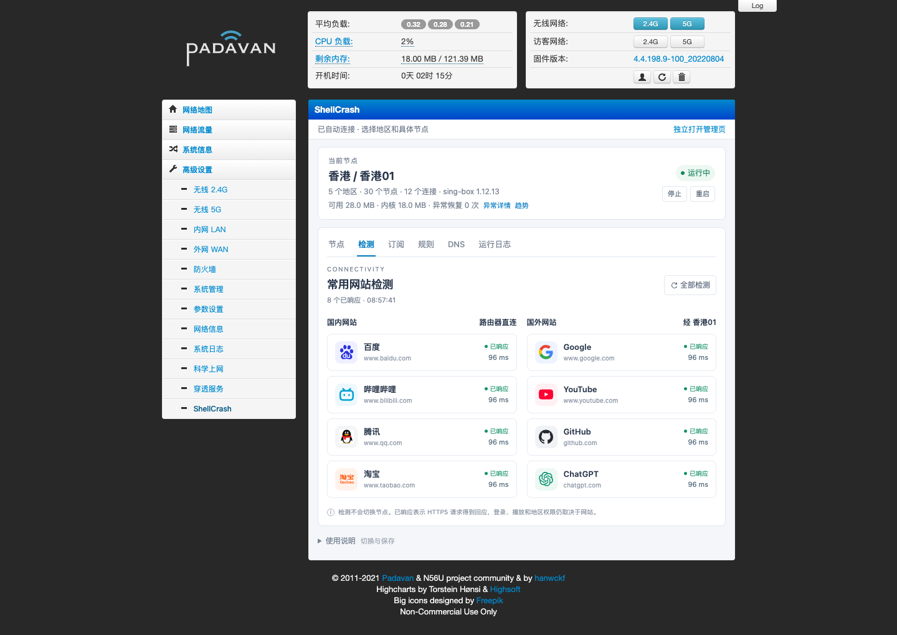
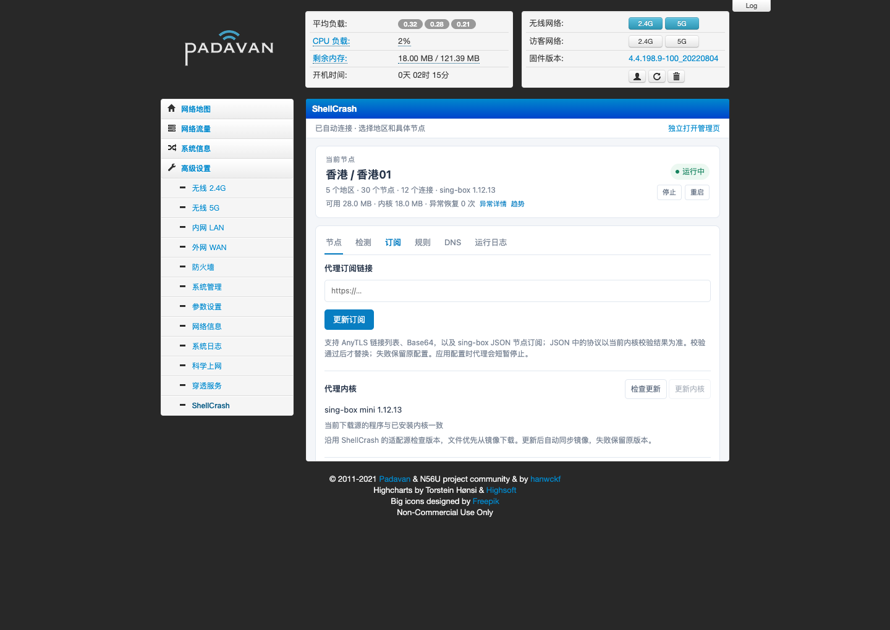

# K2P / Padavan · ShellCrash 可视化管理面板

把 [ShellCrash](https://github.com/juewuy/ShellCrash) 接入 Padavan 管理页，在网页里切换节点、更新订阅、设置 DNS、更新内核和规则，查看内存、异常与日志。

适用于 **K2P / MT7621 + Padavan**。当前使用 ShellCrash **1.9.4release** 和 sing-box mini **1.12.13**；实机固件为 `4.4.198.9-100_20220804`，其他 Padavan 分支暂未验证。

## 安装

1. [下载 v1.0.2 安装包](https://github.com/wcbspp/K2P-Padavan-shellcrash-panel/releases/download/v1.0.2/padavan-shellcrash-panel-1.0.2.zip)，解压到电脑。
2. 开启路由器 SSH，在原“科学上网”页面关闭 SSR 运行开关。
3. 电脑连接路由器局域网，在解压后的文件夹运行：

```sh
python3 tools/deploy.py
```

按提示填写路由器地址、SSH 用户名、端口、管理员密码和订阅。默认用户名为 `admin`、端口为 `22`，按设备实际设置修改。

安装助手会生成配置、上传文件、保存安装前备份，然后部署 ShellCrash、面板和启动适配。电脑需要 Python 3.9+ 和 SSH；macOS / Linux 可直接使用，Windows 使用 WSL。

安装完成后登录 Padavan，点击 **高级设置 → ShellCrash**。沿用路由器登录会话，无需单独输入面板密码。菜单未出现时刷新浏览器缓存。

安装前备份以 `shellcrash-before-` 开头，保存在运行安装命令的目录。已有自定义启动钩子或重复安装时，助手会停止并提示；当前不提供自动升级已有面板的流程。

[安装说明](docs/DEPLOYMENT.md) · [手动部署](docs/MANUAL_INSTALL.md) · [备份与卸载](docs/RECOVERY.md)

## 页面预览

左侧保留原“科学上网”入口，新增 ShellCrash 菜单。以下页面使用示例节点与状态。







## 面板功能

| 页面 | 功能 |
| --- | --- |
| 节点 | 地区分组、搜索、协议标识、切换和保存节点；自动测速取三次成功结果中的最短值 |
| 检测 | 国内直连与国外代理网站的 HTTPS 检测 |
| 配置 | 更新订阅、检查与更新内核、更新 ShellCrash 正式版、设置自定义镜像 |
| 规则、DNS | 运行规则 / 策略组 / 连接查询、国内 IPv4 更新、Mix / 真实 DNS 与 Fake IP 例外 |
| 监控、日志 | 内存趋势、清理阈值、安全清理、异常时间与原因、日志查看和清空 |

首页直接显示当前内核版本与运行时长、内存、开机启动与守护状态；启动来源在配置页查看。K2P 使用 ShellCrash 原生每分钟守护，主动停止后不会被守护重新拉起。

## 与官方 ShellCrash 的关系

ShellCrash 提供终端菜单、订阅获取与转换、内核下载和启动入口。面板调用这些功能，并通过 Padavan 适配脚本执行配置校验、Storage 保存和状态检查。sing-box 实际处理代理流量。

本项目的 K2P 适配包括：

- 将面板接入原厂后台，保留原菜单，复用登录权限。
- 按地区整理节点；更新订阅时保留现有 DNS 与分流设置。
- 适配 Padavan 启动钩子和原生每分钟守护，检查代理进程及管理接口。
- 内核在 RAM 中运行，配置保存在 Storage；恢复下载与配置保存相互独立。
- 低内存时暂缓耗资源的管理操作，限制日志和临时文件大小。
- 配置与内核校验、更新前备份、失败回退、异常记录和安全清理。

安装包附带[官方 ShellCrash 1.9.4 原包](https://github.com/juewuy/ShellCrash/releases/tag/1.9.4)和适配脚本，来源与校验值保存在 `vendor/`。也可[单独下载原包](https://github.com/wcbspp/K2P-Padavan-shellcrash-panel/releases/download/v1.0.2/ShellCrash-1.9.4.tar.gz)。内核由安装脚本从工具源获取，不包含在面板源码包中。

## 订阅更新

默认调用 ShellCrash 从填写的订阅地址直接下载，失败时尝试面板兼容下载。选择转换下载时，可指定 ShellCrash 列表中的服务，并选择失败后依次尝试其他服务。

转换前先预检接口，不携带订阅地址；通过后才发送订阅。**转换服务来自互联网，安全性请自行斟酌。** 失败轮询可能向多家服务发送订阅地址；预检通过不保证转换成功。直接下载只联系填写的订阅地址。

下载内容先放入临时目录，面板整理节点，生成 sing-box JSON 配置。通过内核校验后保存并加载；失败保留或恢复原配置。错误提示显示本次订阅地址、出错接口和尝试记录。

面板支持 AnyTLS、Base64、sing-box JSON，以及 origin/plain、origin/http_simple 的兼容 SSR 链接。兼容 SSR 按 SS（带所需混淆）运行，协议标识显示 SS；其他 SSR 不适用于当前 sing-box，界面会提示未导入数量。Clash YAML 和其他未支持的链接格式需先转换，最终协议仍须当前 mini 内核支持。

当前订阅导入只更新节点，不导入订阅文件中的策略组、分流规则或 rule-providers。已有 DNS 与分流设置由面板保留；转换服务生成的完整规则目前不会生效。内核本身支持更复杂的规则，但本面板尚未提供完整配置导入与编辑。

## 重启、镜像与 DNS

K2P 默认没有持久内核包，重启需重新下载；节点、订阅、DNS 和规则保存在 Storage，不会被内核下载覆盖。有可用外部存储时可设置持久内核包，恢复顺序为 **本地包 → 自定义镜像 → ShellCrash 工具源**。启动恢复使用已安装版本，不自动追新。

自定义镜像可选，在“配置”页维护；配置专用 SSH 上传密钥后，内核和 IP 规则更新可同步到镜像。同步失败单独提示，可重试，不撤回已生效的本地更新。[镜像设置](docs/MIRRORS.md)

国内 IPv4 默认表随安装包提供，不依赖旧 SSR 插件。国内域名使用 cn.srs。Mix 对国内域名与例外名单返回真实地址，其余返回 Fake IP；真实地址仍按分流规则决定直连或代理。当前普通 UDP 直连，IPv6 未启用。[运行方式与限制](docs/ARCHITECTURE.md)

## 固件下载

需要恢复或更换底层固件时，见 [K2P 16 MB Padavan 固件](docs/FIRMWARE.md)。这些第三方固件与面板安装包分开发布，仅适用于 **16 MB 闪存 K2P**，未内置本项目面板；刷机前先保存设备配置。

## 测试与许可

实机测试覆盖订阅更新、DNS 例外、国内分流、服务启停和重启恢复。安装助手通过首次安装、失败回退及恢复测试，尚未在另一台干净设备上完整安装。[测试记录](docs/VALIDATION.md) · [变更记录](CHANGELOG.md)

GPL-3.0-only；组件版权和图标来源见 [NOTICE](NOTICE.md)。发布包不含私人订阅、密码、ZeroTier 身份或运行配置。

规则页可筛选、分页查看内核实际加载的规则、策略组和连接。查询按需执行，不增加后台轮询。[轻量页面验证记录](docs/轻量页面验证.md)
